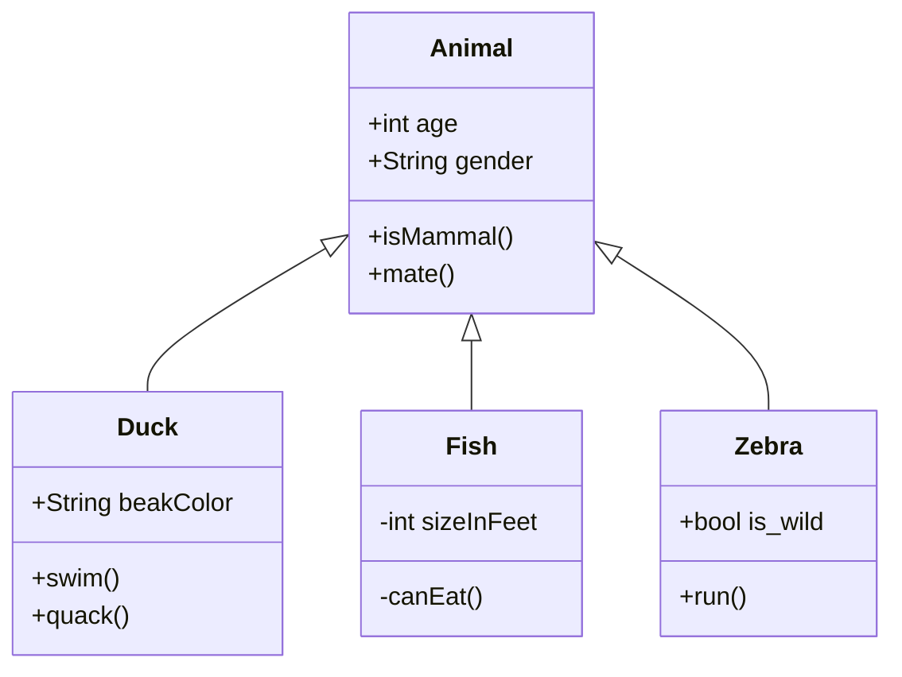

#Idea is to simulate a rest API for handling rules and rule sets

**Entities:**

- entity_root
    - is the root of the entity hierarchy that is used for triage process
    - it is assigned to one specific business unit - this drives the rule set to be used by the triage process
    - it hase a state that represents if it is relevant for the triage process or not
    - entity hierarchy based on the entity root is created based on data from the source data store and is not managed or stored in this application

- entity_root_action
    - is and action that has been taken on an entity root at a specific run of the triage process
    - it links the entity root, the selector that selected the entity and the action that has should be taken 
    - it undergoes different status changes: identified, triggered, executed, failed

- tenant
    - is the entity managing access to the system
    - workflow administrators have access on level of the tenant
    - tenants can be created, activated and deactivated and deleted  by administrator
    - tenant can be only deleted if there are no business unit and rule sets assigned to it
    - tenant can be viewed by anyone with read privilege on that tenant

- business_unit
    - belongs to one tenant
    - represents the linkage between rule sets and entity root the rule set is supposed to be applied to
    - business units can be created, activated and deactivated and deleted by administrator
    - business unit can be only deleted if there is no selector assigned to it
    - business unit can be viewed by anyone with read privilege on that tenant

- rule_template
    - Represents a template for a rule
    - A rule template can be created, deleted and modified by rule administrator only
    - It can be viewed by anyone having read role or any tenant
    - Template has an ID, name, description and an expression representing the rule logic

- rule_instance
    - is an instantination of the rule template in context of an rule set
    - It is created by an workflow administrator based on a rule template
    - It can be created, deleted and modified by anyone having workflow administrator rule for the tenant of the rule set this instance belongs to

- rule_set
    - identifies the root entities and rules to be applied to them
    - it has a list of rule instances
    - is associated with a tenant for access controll
    - it has a list of selectors to identify entity roots to be apply to
    - it also have an action to be applied when the rules in the rule set are satisfied for an entity root
    - it has a default action to be applied for all entity roots not selected by any rule

- selector
    - is a combination of business unit and status
    - used to identify root elements to be processed by a rule set
    - a selector is created in a context of an rule set by workflow administrator and is limited to business units associated with the tenant the rule set belongs to

- action
    - represents an action to be performed on the entity root
    - usually an state change into a target state

